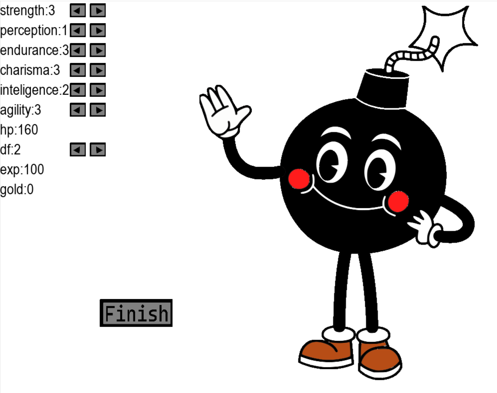
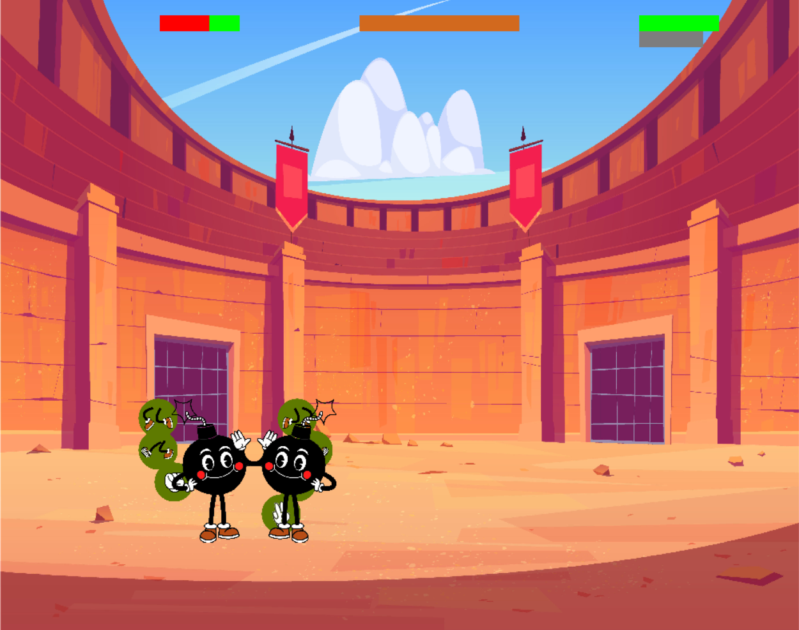

---

---
### Description
2D game focused on PVE (player versus envirement) and RPG elements. The project uses standard python libraries and Pygame module.
---

### Instalation
---
If you want to run source code make sure you have Pygame module on your machine, if so download repo and run main.py file.

If your desire is to only play and kill some time dowload dist.rar file unpack and run main.exe.The source code won't be available.
---
### Features included
 - simple animations like walking, jumping, attacking
 - sound effects
 - collision system
 - enemy's AI.
 - bars to chase characters parameters
 - buttons (to navigate on game, change statistics, taking action)
 - save and load system (based on serialization)
 - progression (the more fight won the more difficult is the enemy)
 - performence of characters depends from their statistics
### Statistics
1. strength - attacks takes more healh, and character have more health points
2. perception - higher chance to hit enemy or avoid attack
3. endurance - for now do nothing
4. charisma - increace aplaus bar faster ( the higher aplaus the more currency for upgrades)
5. inteligence - increase amount of experience points you get (experience can be used for upgrades)
6. agility - you can jump higher, and avoid attact more often
7. hp - depends from strenght
8. df - (defence) points from here will be taken before heath bar (can be upgraded with currency)
---
### Other info
- After fight player get experience points and currency to later update (ammount of these depends from statistics)
- you can save game by clicking save button, can be later restored by load button in main menu, click on save with correct date and time
---

